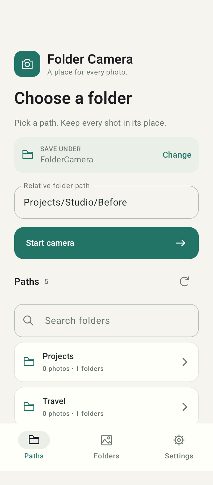
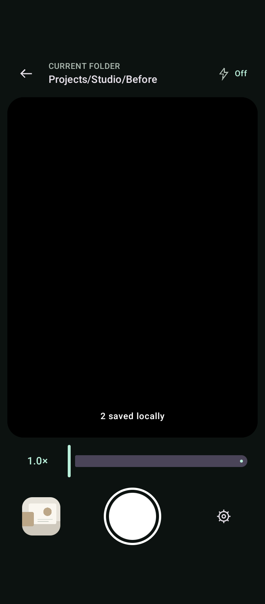
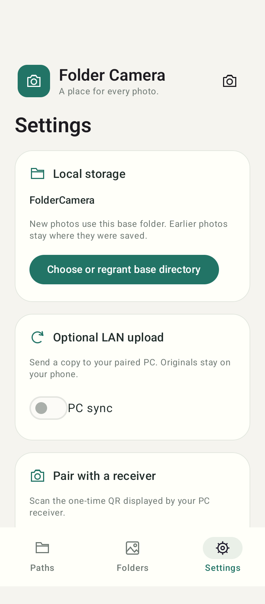
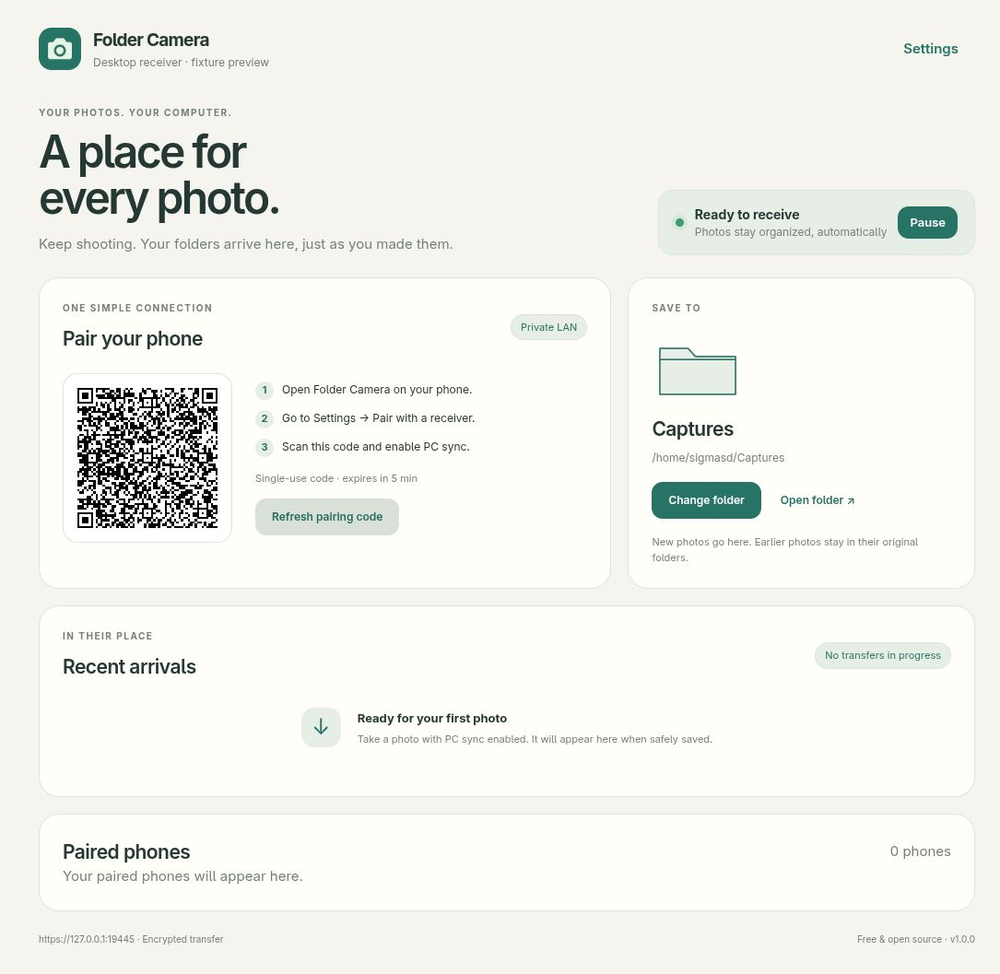

# Folder Camera

Native Kotlin Android folder camera with an optional TypeScript/Deno desktop receiver. The phone is fully usable offline, without pairing, an account, or a PC. Licensed GPL-3.0-or-later. The 1.0.0 release candidate is being prepared for free F-Droid distribution and a one-time paid Google Play download. Store submission status is tracked in [release/README.md](release/README.md).

## Screenshots

<p>
  <a href="site/assets/screenshots/android-paths.png"></a>
  <a href="site/assets/screenshots/android-camera.png"></a>
  <a href="site/assets/screenshots/android-settings.png"></a>
</p>

Native Android captures with sample folders/photos. The emulator capture omits the live camera preview.

[](site/assets/screenshots/desktop-receiver.jpg)

Desktop interface preview with sample data. [Download the Android APK and desktop receiver](https://sigmasd.github.io/folder-camera/).

## Android build

Requirements: JDK 21 for release/F-Droid parity (prototype checks also ran on JDK 25), Android command-line SDK tools, SDK platform **37.0**, Build Tools **36.0.0**. No Android Studio is required.

```sh
sdkmanager 'platforms;android-37.0' 'build-tools;36.0.0' 'platform-tools'
export ANDROID_HOME="$HOME/Android/Sdk"
cd android
./gradlew :app:assembleDebug :app:testDebugUnitTest :app:lintDebug
adb install -r app/build/outputs/apk/debug/app-debug.apk
```

Alternatively, put `sdk.dir=/absolute/sdk/path` in untracked `android/local.properties`. The Gradle wrapper and its distribution checksum are pinned. `android/app/schemas/` contains the Room schema. First builds and Robolectric SDK downloads need internet; application runtime does not.

Production application ID: `io.github.sigmasd.foldercamera` (debug adds `.debug`); minSdk 26 (Android 8), target/compile SDK 37 (Android 17). API 26 is a conservative product support floor, above the libraries’ API-23 minimum; Keystore/SAF/network APIs were checked with minSdk lint. API 23–25 compatibility is not claimed. Kotlin is built into AGP 9.1.1; Compose compiler 2.2.10, KSP 2.3.12, Compose BOM 2026.09.00, CameraX 1.6.2, Room 2.8.5, WorkManager 2.11.2. Other supported stable dependencies are pinned in `android/app/build.gradle.kts`.

## Standalone use

1. Choose a base directory through the system folder picker. Prefer an on-device folder such as Pictures/FolderCamera. The app keeps the specific tree grant, without broad storage access.
2. Enter a relative path or select a folder from **Paths**, for example `Projects/Job A/Before` or `Été/صور/قبل`, then **Start camera**. The previous path is only a suggestion.
3. Allow camera access, then take any number of JPEG photos. The full destination stays visible. **Change folder** edits the destination; cancel keeps the confirmed session.
4. Browse **Folders** to preview, share, or export photos. Photos in the selected public tree survive uninstall. App-private staging, metadata, and credentials do not.

**Paths** lists the complete folder tree in the selected base directory, including empty folders and ancestors. Use search to find a nested path directly, or the row arrow to open subfolders. There is no 20-item recency limit; rows are rendered lazily and the directory scan runs off the UI thread. Tap a folder to fill the path, then Start camera to confirm.

The camera has **Off**, **Auto**, **Flash** (at shutter), and **Always on** (continuous torch) modes when supported. Pinch the preview or use the zoom slider; the range follows the device’s CameraX limits. Light and zoom selections survive rotation within the active session.

Rotation and an ordinary background return retain the in-memory session. A fresh Activity/ViewModel after a closed task or process restart returns to the path gate. Settings and browsing work without a capture destination.

Local saving uses a private CameraX staging file, persisted metadata, a separately journaled SAF document URI, and a size/SHA-256 check of the completed public copy. The app says Saved locally only after verification. On a provider failure it retains staging. Regrant the **original** folder, restore provider availability/free space, and choose **Retry local saves**. A verified retained staging photo can also be exported through Settings if the original root is no longer recoverable; this does not silently move its original destination or upload task. Changing the base applies to new sessions; earlier grants and locations remain. Failed/incomplete known documents are excluded from in-app previews. Other file managers may see an incomplete document while its provider write is in progress; SAF has no universal atomic-publish primitive.

Portable names are preserved exactly. Limits and rejected names are specified in [protocol.md](docs/protocol.md). Accepted paths are never silently trimmed or renamed.

## Optional receiver

The desktop app provides QR pairing, folder selection, phone management, recent arrivals, tray controls and optional launch at login. Downloadable desktop packages include the runtime and internal certificate generation; users do not install Deno or OpenSSL. See [desktop release documentation](docs/desktop-receiver.md) for platform validation and signing status.

For CLI/source development, install Deno **2.9.7**. Dependencies are open source and pinned in `receiver/deno.lock`; bundled license notices are under `third_party/receiver`.

```sh
cd receiver
deno task check
deno task lint
deno task test
# Optional CLI restart/revocation smoke test (Python 3, loopback port 19443):
# deno cache --frozen src/main.ts && python3 tests/cli_smoke.py
# Optional actual automatic-LAN integration test (dummy JPEG):
# python3 tests/automatic_smoke.py
deno task start
```

No startup flags are needed for a new receiver:

- **Address:** automatically selects a private LAN interface, preferring IPv4 and the lowest-metric Linux default route. Known VPN/container interfaces and zero-MAC tunnel interfaces are skipped. If no route is present, it still selects a suitable local Wi-Fi/Ethernet address without testing internet reachability.
- **Photos:** `~/Captures` by default. An explicit `--root` is saved and reused on subsequent launches.
- **State:** Linux uses `$XDG_STATE_HOME/folder-camera` when XDG_STATE_HOME is absolute, otherwise `~/.local/state/folder-camera`; Windows uses `%LOCALAPPDATA%/FolderCamera`; macOS uses `~/Library/Application Support/FolderCamera` (existing legacy profiles are reused). `--state` remains an override for existing custom state.
- **Port:** starts at 8443, automatically advances if occupied, and remembers the chosen port. An explicit `--port` stays exact and errors if unavailable.
- **Pairing:** displays the single-use five-minute QR automatically when no authorized device exists. Later runs reuse the receiver identity/certificate/credentials; `--pair` creates a new session when adding or re-pairing a phone.

Startup prints the actual address, interface, destination and state directory. Preferences are stored in private `receiver-config.json`. The auto bind preference stays `auto`, so the address is rediscovered at each restart instead of freezing yesterday’s IP. To return from an explicit address to detection, start once with `--bind auto`. Explicit `--root`, `--bind`, `--port` and `--state` remain available. Wildcard/public binds are rejected.

If migrating a pre-configuration receiver that already has upload receipts, provide its existing `--root` once. Older versions did not record that directory, so guessing could silently change its destination; after this one-time migration it is remembered. Existing custom `--state` also needs its override.

Photo root and state must remain independent, non-nested directories. Credentials and receipts live only in state, not photo directories. The controlled `.folder-camera-partials/` directory is reserved under the photo root so temporary uploads share the destination filesystem.

On first build/cache preparation, Deno downloads the pinned QR dependencies. Prepare an offline runtime with `deno cache --frozen src/main.ts`; the listener then needs no internet. `deno task start` allows local filesystem/network use without certificate-generation subprocesses. Local interface/home information is allowed through Deno’s narrow `--allow-sys=networkInterfaces,homedir` capability; Linux route selection reads `/proc/net/route`. No external connection is used for detection. You may narrow Deno permissions to your chosen paths and listener once dependencies are cached; filesystem ancestor validation also needs read access to the ancestors of those directories.

Options: `--max-mib` (1–256, default 64), `--concurrency` (1–8, default 2), `--timeout-seconds` (10–600, default 240). Each transfer also has a 30-second idle timeout, pairing requests a ten-second timeout, and at most 32 concurrent handlers. There is no management web page or HTTP fallback.

Protect the root and its ancestors from untrusted concurrent filesystem mutation. The receiver rejects existing symlinks and ambiguous case/canonical aliases, but Deno path-based calls do not provide complete openat/no-follow race resistance. Windows uses native no-replace/write-through publication and private user-profile state. Local NTFS is the initial Windows target; network/removable filesystem durability is not claimed. Desktop platform readiness is recorded separately. See [security.md](docs/security.md).

### Fedora firewall

Determine your Wi-Fi/LAN interface and active zone with `ip -brief address` and `firewall-cmd --get-active-zones`. Use the port printed at startup (normally 8443) if a fallback port was selected. Open only the chosen interface's trusted home/LAN zone, for example:

```sh
sudo firewall-cmd --zone=home --add-port=8443/tcp
# If you deliberately want the rule to persist:
sudo firewall-cmd --zone=home --add-port=8443/tcp --permanent
# Remove the rule when no longer needed:
sudo firewall-cmd --zone=home --remove-port=8443/tcp
sudo firewall-cmd --zone=home --remove-port=8443/tcp --permanent
```

The example assumes your intended interface belongs to `home`; do not change arbitrary interfaces or open a public zone blindly. Do not set up router port forwarding. State directories are mode 0700 and private keys/state files 0600. Keep the state directory across restarts; deleting it changes receiver identity and certificate and requires explicit re-pairing.

### Pairing and syncing

Start the receiver normally; a QR appears automatically on first use. Use `--pair` to request a new session later. The GUI shows a five-minute, single-use QR; CLI users see it in the terminal and equivalent JSON/manual fields: receiver ID, HTTPS address, SHA-256 certificate fingerprint, and temporary secret. It never prints permanent device tokens.

On Android, open Settings, grant local network access on Android 17+, then scan the QR and confirm Pair. Manual pairing accepts the same trusted fingerprint and one-time secret. For replacement of a different receiver, use manual pairing and explicitly discard the old delivery tasks before switching; originals remain intact. A QR for a different receiver cannot silently replace it.

Enable **PC sync**. The default is **Future photos only**. To include existing captures, explicitly select the existing folders in the enable dialog. Photos upload only after safe local save. Active uploads and WorkManager share durable per-task claims; transient failures back off. LAN transport selects available Wi-Fi/Ethernet sockets and DNS without requiring validated internet. Workers can attempt offline and back off; they do not use a validated-internet scheduling constraint. Background retries depend on Android scheduling and are not immediate guarantees.

When the PC is unavailable, capture continues. Reconnect prompts a retry of transient pending tasks. **Retry uploads now** also retries resolved permanent errors. Disabling sync stops scheduling and pauses retained tasks; an already running request can complete and committed PC files are not undone.

A changed PC IP can be entered in Settings and **Verify and update address**; the app retains the certificate and receiver identity. Changed certificates require trusted re-pairing. mDNS discovery is deferred.

To revoke a device, stop the receiver first, then:

```sh
deno task start --list-devices
deno task start --revoke DEVICE-UUID
```

Restart the normal listener afterward. An OS advisory lock prevents concurrent state writers and releases on process death. Revocation uses device IDs, never token values.

## Verification and remaining device checks

See [testing.md](docs/testing.md) for actual results, blockers, and the acceptance checklist; [protocol.md](docs/protocol.md) for the wire contract; [dependencies.md](docs/dependencies.md) and [THIRD_PARTY_NOTICES.md](THIRD_PARTY_NOTICES.md) for the dependency audit. Official F-Droid inclusion is awaiting maintainer review; its clean build, scans and developer-signature APK comparison pass. Release signing keys stay outside Git. The app uses no telemetry, proprietary QR service, Firebase, Play Services, advertising or cloud photo endpoint.

## Public source and release preparation

Source: https://github.com/sigmasd/folder-camera
Product/privacy site: https://sigmasd.github.io/folder-camera/

The signed Android APK and tested desktop installers are published on the product website. Windows/macOS publisher signing and notarization remain pending. Android APK/AAB builds use private keys outside Git; see [release/README.md](release/README.md). The current production identity is distinct from the original prototype `org.foldercamera`; keep the prototype installed while validating the new app and recover/export any private staging before uninstalling it. Saved public-tree photos remain accessible, but private metadata/pairing are not silently transferred between app identities.
